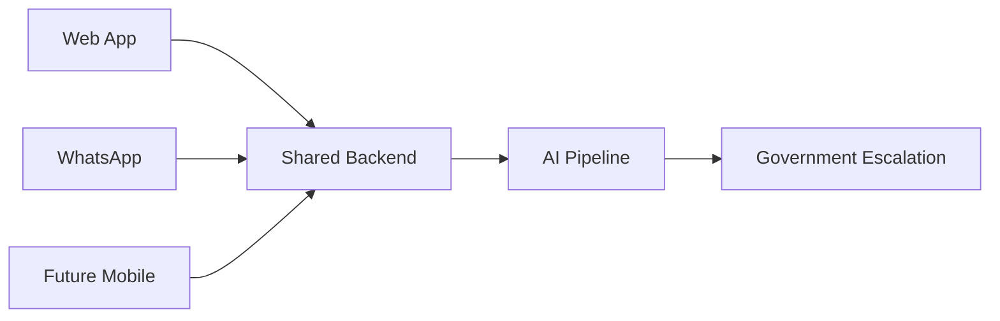

# CivicPulse

> **Evidence-Driven Civic Accountability Platform**


Turning verified citizen evidence into explainable AI decisions, government-ready complaints, and transparent public accountability.


## Highlights

- 🧠 5 AI Agents
- ✅ Stage-0 Evidence Trust Gate
- 📍 Community Clustering
- 📄 Complaint + RTI Generation
- 👤 Human Approval Required
- 🏛 Government Escalation
- ☁️ Google Cloud Run Deployment

CivicPulse is an AI-powered civic accountability platform that transforms verified citizen-submitted infrastructure evidence into structured community intelligence, actionable government-ready documents, and transparent escalation workflows.

Instead of generating another ticket number, CivicPulse helps citizens build evidence that is difficult to ignore.

## At a Glance

| | |
|---|---|
| **Problem** | Civic complaints rarely lead to accountable action. |
| **Solution** | AI-powered evidence verification and government-ready escalation. |
| **Built With** | Gemini, Google Maps Platform, Cloud Run, React, FastAPI. |
| **Outcome** | Verified evidence → Community intelligence → Government action. |

## Live Links

🌐 **Live Demo**  
https://civicpulse-89026185279.us-central1.run.app/

📄 **Project Description**  
https://docs.google.com/document/d/1hWUT76pNRuKSaGgoruwX7dj_d7txXO5UQVcaR2jI2OI/edit?usp=sharing

---

# The Problem

Most civic platforms successfully collect complaints but fail to create accountability.

They typically:

- Generate passive ticket numbers.
- Accept low-quality or irrelevant evidence.
- Treat every complaint independently.
- Provide little transparency after submission.
- Offer no structured path for escalation.

As a result, important civic issues disappear into administrative queues instead of becoming actionable public cases.

# The Solution

CivicPulse transforms a single infrastructure photo into a verified, explainable, government-ready civic case.


# Why CivicPulse?

Most civic platforms focus on **report collection**.

CivicPulse focuses on **government accountability**.

Instead of asking:

> "How can citizens report problems?"

CivicPulse asks:

> **"How can verified community evidence drive real government action?"**

The platform combines evidence validation, AI reasoning, community intelligence, human approval, and official escalation into a single workflow.

---

## Traditional Reporting vs CivicPulse

| Traditional Platforms | CivicPulse |
|----------------------|------------|
| Complaint Collection | Evidence Validation |
| Individual Reports | Community Intelligence |
| Ticket Numbers | Government-ready Documents |
| Manual Follow-up | AI-assisted Drafting |
| Closed Ticket | Public Accountability |
| Basic Dashboard | Explainable AI |

##  Citizen Journey


## Product Highlights

| Capability | Description |
|------------|-------------|
| Evidence Trust Gate | Rejects irrelevant uploads before AI processing |
| Explainable AI | Every AI decision includes confidence and reasoning |
| Community Intelligence | Nearby reports become collective evidence |
| Accountability Drafting | Complaint + RTI generation |
| Human Approval | Citizens remain in control |
| Government Escalation | Email & PDF dispatch with audit trail |

# Key Features

## Evidence Validation


## AI Workspace


## Community Intelligence


## Public Tracker

v

## Complaint Workspace

v


## Architecture Overview


5 specialized AI agents transform trusted evidence into explainable community intelligence and government-ready action.


## Google Technologies

| Technology | Why It Matters |
|------------|----------------|
| Gemini 2.5 Flash | Infrastructure understanding, reasoning, complaint drafting |
| Google Maps Platform | Spatial verification & community clustering |
| Cloud Run | Production serverless deployment |
| Cloud Build | Automated CI/CD |
| Secret Manager | Secure runtime credential management |

# Tech Stack

| Layer | Technology |
|---------|------------|
| Frontend | React, Vite, TypeScript |
| Backend | FastAPI |
| Database | SQLite |
| AI | Gemini |
| Maps | Google Maps Platform |
| Email | SendGrid |
| PDF | ReportLab |
| Deployment | Docker + Google Cloud Run |

---

## System Guarantees

Unlike traditional AI demos, CivicPulse guarantees:

- No automatic government submissions
- Human approval before every escalation
- Explainable AI reasoning
- Evidence-backed metrics only
- Immutable audit trail
- Transparent community intelligence

Every visible insight inside CivicPulse can be traced back to verified citizen evidence.


# Local Setup

## Prerequisites

- Python 3.11+
- Node.js 18+
- Gemini API Key
- SendGrid API Key

## Backend

```bash
cd backend
python -m venv venv

# Windows
venv\Scripts\activate

pip install -r requirements.txt

uvicorn app.main:app --reload
```

## Frontend

```bash
cd frontend

npm install

npm run dev
```

---

# Access Anywhere

CivicPulse supports multiple reporting channels that all share the same backend pipeline.

| Channel | Status | Purpose |
|---------|--------|--------|
| Web App | ✅ Primary | Full dashboard: submit, track, approve, escalate |
| WhatsApp | ✅ Available | Fast mobile reporting — photo + location = case filed |
| Mobile App | 🔜 Planned | Native app for iOS and Android |

The web app is the complete experience. WhatsApp is a lightweight reporting channel — citizens can submit evidence without opening a browser. All processing runs through the same backend: Stage-0 Validation → Agent Pipeline → Community Clustering → Accountability Drafts.



**Multiple channels. One backend.**

### Technical Notes

- Current implementation uses **Twilio WhatsApp Sandbox** for development.
- Architecture is provider-agnostic. Migrating to Meta Cloud API requires changing only the adapter helpers in `whatsapp.py`.
- The WhatsApp channel is gated by `WHATSAPP_ENABLED=true` in the environment.

### Upcoming WhatsApp Improvements

The next evolution focuses on making WhatsApp significantly more natural and accessible while keeping the same backend pipeline unchanged. These are planned improvements — **not yet implemented**:

1. **Multilingual conversations** — Hindi, Tamil, Marathi, and other Indian languages
2. **Voice reporting** — send a voice note describing the issue
3. **Repair verification** — send a follow-up photo when the issue is fixed
4. **Smart notifications** — proactive updates when your case advances
5. **Accessibility improvements** — richer formatting for screen readers

---

# Roadmap

## Near Term

- Voice Reporting
- Regional Languages
- Repair Verification

## Long Term

- Government API Integration
- Smart City Integrations
- Multi-level Escalation


# Authors

Built and designed by

Sujal Gupta

B.Tech Information Technology

VESIT Mumbai

Solo Project
