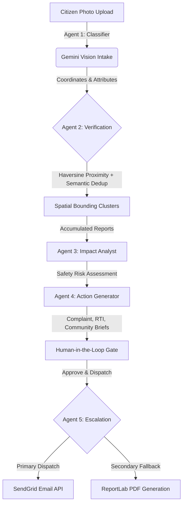

# CivicPulse 🏛️⚡
> **Active Civic Accountability Engine**

[](https://youtu.be/dummy-link)
[](https://cloud.google.com/run)
[](https://deepmind.google/technologies/gemini/)

CivicPulse converts citizen-submitted photos of infrastructure failures into verified, clustered evidence trails and sendable legal dispatches — bypassing passive administrative queues to compel municipal response.

---

## 🎯 1. The Problem & Why Existing Systems Fail

Traditional civic engagement apps are merely **passive dashboards**. Citizens upload photos of potholes, garbage piles, or broken lights, only for these tickets to disappear into a municipal black hole. 

* **The Reporting Trap**: Existing platforms focus on *logging* problems, not resolving them. 
* **Lack of Leverage**: Individual citizen reports lack the legal weight or compiled community volume required to force municipal action.
* **Citizen Apathy**: When submissions go unanswered without clear follow-up, citizens stop reporting, leading to community apathy.

**CivicPulse solves the accountability gap, not the reporting gap.** Instead of a passive dashboard, it groups localized reports into unified community evidence files and auto-compiles official complaint dispatches and legal RTI (Right to Information) briefs.

---

## 💡 2. The Solution & The Power of RTI (Right to Information)

**RTI is the ultimate legal leverage point of civic accountability.** CivicPulse leverages Gemini to draft Right to Information (RTI) briefs from clustered citizen photos. By legally demanding municipal maintenance contracts, contractor names, and budgets allocated to specific coordinates, it provides citizens with the legal tools necessary to force official response.

---

## 🚀 3. Features

* **Visual Intake & Assessment**: Extracts categories, details, and severities from citizen uploads.
* **Duplicate Detection Engine**: Performs perceptual image hashing to block visual duplicate submissions while keeping genuine nearby reports.
* **Operations Center**: Transparent public ledger showing live stats, unresolved delays, and ward patterns.
* **City-wide GIS Mapping**: Interactive Google Maps showing issue cluster density and risk-coded markers.
* **Neighborhood Impact Assessment**: Identifies safety hazards and neighborhood deterioration scores using spatial reports.
* **Complaint Draft Workspace**: Generates official complaint letters and RTI dispatches.
* **Dual Escalation Channel**: Externally dispatches to authorities via SendGrid HTTP Mail and prints legal PDF packages locally.

---

## 🧠 4. AI Pipeline (5-Agent Architecture)

CivicPulse runs on a structured **Observe ➔ Reason ➔ Create ➔ Act** agentic workflow:



### The 5-Agent Breakdown:
1. **Agent 1: Visual Intake Classifier (Gemini Multimodal)**: Scans raw photos to extract category, severity (1-5), description, and calculates a visual credibility score.
2. **Agent 2: Verification & Spatial Clusterer (Geo-Scanner)**: Groups duplicate reports within a 300-meter radius using Haversine calculation and Gemini semantic comparison to form unique case clusters.
3. **Agent 3: Impact Analyst (Context Synthesizer)**: Compiles all evidence inside a cluster to evaluate pedestrian safety, local infrastructure risks, and safety levels.
4. **Agent 4: Action Generator (Brief Compiler)**: Automatically drafts localized municipal complaints, official RTI applications, and community summaries grounded strictly in the compiled evidence.
5. **Agent 5: Escalation Agent (Action Dispatcher)**: Transmits authorized documents to local ward offices via SendGrid. If mail dispatch fails, it automatically compiles a downloadable PDF package using ReportLab.

---

## 🏛️ 5. Technology Stack & Google Cloud Services

### Tech Stack
* **Frontend**: React 19 (TypeScript), Vite, Tailwind CSS, TanStack Query, Framer Motion, Lucide Icons.
* **Backend**: FastAPI, SQLModel (SQLite with WAL mode enabled for concurrent writes), Pydantic.
* **Escalation**: SendGrid HTTP Mail API, ReportLab PDF generator.

### Google Cloud Services
* **Google Gemini API (3.5 Flash / 2.0 Flash)**: Enforces strict schemas and structured JSON outputs for predictable agent behaviors.
* **Google Maps JavaScript API**: Renders an interactive operations tracker with bounds auto-fitting.
* **Google Cloud Run**: Serverless containerized deployment with scale-to-zero capabilities.
* **Google Cloud Build**: Automated CI/CD pipelines building, pushing, and deploying container images.
* **Google Secret Manager**: Secure production environment key binding.

---

## 🔑 6. Demo Credentials & Setup

### Demo Credentials
* **Role**: Auditor / Judge Evaluation
* **Access URL**: `http://localhost:5173` (Local) / Cloud Run URL
* **Demo Scenarios**: Included on the intake page dropdown to load preset reports instantly.

### Local Setup
#### Backend Setup
```cmd
cd backend
python -m venv venv
call venv\Scripts\activate
pip install -r requirements.txt
copy .env.example .env
uvicorn app.main:app --reload --port 8000
```
*(Populate your `GEMINI_API_KEY` in the newly created `.env` file).*

#### Frontend Setup
```cmd
cd frontend
npm install
npm run dev
```

---

## ☁️ 7. Production Deployment (Google Cloud Run)
The application is configured to deploy as a unified Docker container to Google Cloud Run, building React assets and routing them through FastAPI's catch-all SPA router:
```bash
# Build and deploy image
gcloud builds submit --config=cloudbuild.yaml --substitutions=_SENDGRID_FROM_EMAIL="your-verified-sender@example.com"

# Update service environment variables
gcloud run services update civicpulse --region us-central1 --update-env-vars="APP_BASE_URL=https://your-cloud-run-url.run.app"
```

---

## ⏱️ 8. Demo Flow (5-Minute Evaluation Guide)

The platform is designed to be evaluated live in under 5 minutes:

* **Phase 1: Submit Report (60s)**: Choose a demo scenario from the intake dropdown to load verified coordinates and photo, then click "Submit to Operations Center".
* **Phase 2: Watch AI Verification (60s)**: View the Gemini multimodal verification classifier processing attributes and checking visual integrity.
* **Phase 3: Platform Intelligence (60s)**: Open the Tracker/Operations Center, review the transparency metrics, ward patterns, GIS map, and silence ledger.
* **Phase 4: Complaint Workspace (60s)**: Inspect a case file, review the AI decision timeline and the automatically compiled RTI applications.
* **Phase 5: Dispatch & Accountability (60s)**: Authorize a draft, trigger Email Dispatch, review real-time API logs, or generate a PDF package.

---

## 💡 9. Innovation & Future Scope

### Innovation
* **Passive Evaluation Guide**: Built-in non-blocking tour that dynamically assists auditors and tracks completed steps in real time.
* **Explainable Trust Models**: Every agent decision maps raw inputs to deterministic logic gates before proceeding.

### Future Scope
* **Cloud SQL Migration**: Transition SQLite to Cloud SQL PostgreSQL.
* **Citizen Verification Votes**: Decentralized consensus layers to corroborate resolved reports.
* **Government Webhook Integrations**: Native webhook channels to post directly to municipal ticketing networks.
