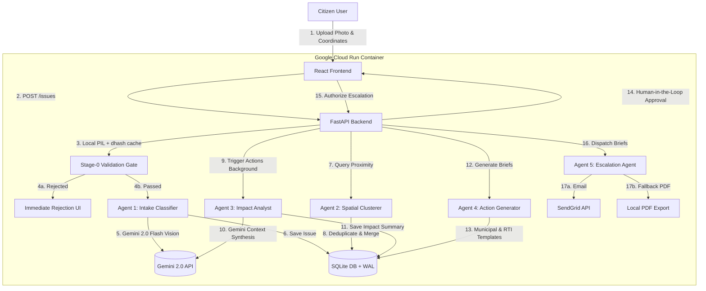

# CivicPulse 🏛️⚡
> **Active Civic Accountability Engine**

 *(Hero Image Placeholder)*

---

## ⚡ 1. The 30-Second Elevator Pitch
Citizens already have tools to log civic complaints. **The bottleneck isn't reporting — it is accountability.** Individual tickets disappear into municipal black holes with no follow-up, no compiled evidence trail, and no consequence.

**CivicPulse converts citizen-submitted photos into verified, clustered evidence trails and sendable legal dispatches (RTI & Municipal Grievances) within minutes.** By moving from individual complaints to clustered public ledgers, CivicPulse gives communities the collective leverage required to compel municipal response.

---

## 🎯 2. The Problem
Municipal grievance systems suffer from two structural failures:
1. **Passive Logging**: Existing apps merely log issues. A citizen gets a ticket number; nothing happens next.
2. **System Pollution**: Duplicate uploads, selfies, documents, and screenshots flood municipal databases, wasting review time and blowing up AI token budgets.
3. **Power Asymmetry**: Individual complaints lack the legal weight or compiled volume needed to force action.

---

## 💡 3. Why Existing Solutions Fail
- **MyGov / Ticket Portals**: Focus on database collection, not dispatching legally backed paperwork.
- **Manual RTI Filing**: Requires legal expertise, fee payments, and manual tracking that average citizens cannot perform.
- **Analytics Dashboards**: Present aggregate ward scores that officials ignore, rather than concrete, evidence-backed action documents.

---

## ✨ 4. Innovation Highlights
- **Evidence Over Invention**: No fabricated statistics. Every number in CivicPulse traces back to a verified report.
- **Collective Spatial Leverage**: Combines multiple reports of the same street-level issue into a single, severe, community-backed case file.
- **Statutory Legal Drafting**: Automatically generates Section 6(1) Right to Information (RTI) applications, giving citizens legal standing.
- **Preemptive Spam Filtration**: Stage-0 rejects invalid media locally and via Gemini Vision before it registers in the database.

---

## 🗺️ 5. End-to-End Demo Flow (Try It in 2 Minutes)
1. **Intake**: Upload a photo on the Intake Page. *(Demo: Select the "Pothole on Linking Road" demo case to pre-fill coordinates and note).*
2. **Check the Rejection Gate**: Try uploading a selfie or a screenshot. The Stage-0 Validation Gate will reject it instantly with a checkbox checklist.
3. **Observe the Pipeline**: Submit the report. Watch Agent 1 and Agent 2 run synchronously to classify the issue and map it.
4. **Inspect the Case Operation File**: Open the tracker, find your pin, and view the Case File. Here you see:
   - **Agent 1 visual attributes** (credibility score, severity).
   - **Agent 2 spatial cluster details** (showing how many neighbors reported it).
   - **Agent 3 impact assessment** (evidence-based safety risks).
5. **Approve Action Drafts (Agent 4)**: View the generated Municipal Grievance and RTI application drafts. Click **Authorize** (Human-in-the-Loop gate).
6. **Trigger Escalation (Agent 5)**: Click **Send Email** to dispatch the packet to the ward office via SendGrid, or click **Save PDF** to export a formatted document.

---

## 🧠 6. AI Pipeline & 5-Agent Architecture



### The AI Agents:
1. **Stage-0 Validation**: Pillow checks (brightness, blur, contrast) + Gemini Vision gate to filter out screenshots, certificates, and selfies.
2. **Agent 1: Visual Intake Classifier**: Extracts classification, severity (1-5), details, and visual credibility score.
3. **Agent 2: Spatial Clusterer**: Groups issues within a 300m radius using Haversine formula and Gemini semantic comparison.
4. **Agent 3: Impact Analyst**: Evaluates safety risks and local pedestrian hazards without fake ward scores.
5. **Agent 4: Action Generator**: Drafts municipal grievances and Section 6(1) RTI applications using official legal formats.
6. **Agent 5: Escalation Agent**: Transmits drafts to ward offices via SendGrid, falling back to local PDF exports.

---

## 🛠️ 7. Google Technologies
- **Gemini 2.0 (Google GenAI SDK)**: Powering Stage-0 validation, classification, semantic deduplication, and drafting.
- **Google Maps JavaScript API**: Powers the interactive Operations Map with custom bounds fitting and safety pins.
- **Google Cloud Run**: Serverless containerized deployment with scale-to-zero capability.
- **Google Secret Manager**: Secure storage for Gemini API keys.
- **Google Cloud Build**: Automated CI/CD deployment pipelines.

---

## 🔍 8. Explainability & Responsible AI
- **Explainable Metrics**: The `credibility_score` is defined in the UI as the AI's image quality and classification confidence. Risk level thresholds are deterministic (low ≤ 2 reports, moderate 3-7, high > 7).
- **Human-in-the-Loop Gate**: Agent 5 is blocked behind an explicit citizen authorization request. The backend throws a 403 Forbidden error if a client attempts to escalate an unauthorized draft.
- **Mandatory Disclaimers**: All RTI drafts are prefixed with `"AI-generated draft. Review before submission."` enforced by Pydantic model validation.
- **No Fabricated Data**: No fake ward scores, officer ratings, or estimated completion times. Everything is derived from real citizen evidence.

---

## 📈 9. Screenshots & Demo GIF

 *(Demo GIF Placeholder)*

 *(Operations Dashboard Screenshot)*

 *(Action Workspace Screenshot)*

---

## 🧪 10. Local Setup & Testing

### Prerequisites
- Python 3.11+
- Node 18+
- Gemini API Key ([Google AI Studio](https://aistudio.google.com))

### Backend Setup
```bash
cd backend
python -m venv venv
source venv/bin/activate  # Windows: venv\Scripts\activate
pip install -r requirements.txt
python -m pytest tests/ -v
uvicorn app.main:app --reload
```

### Frontend Setup
```bash
cd frontend
npm install
npm run dev
```

---

## 🚀 11. Deployment
Deployed on **Google Cloud Run** using `cloudbuild.yaml` with automatic scaling.

---

## 🔮 12. Future Scope
- **Firebase Realtime DB**: To support live multi-user incident tracking.
- **Voice Grievance Intake**: Allowing citizens to narrate details, translated to text via Gemini.
- **Multi-language RTI generation**: Supporting local regional languages.
