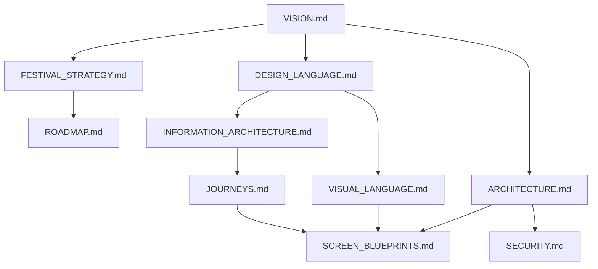

# CivicPulse Documentation: Start Here

Welcome to the CivicPulse knowledge architecture. This directory organizes all technical, design, product, and governance standards into a numbered, structured hierarchy.

---

## 1. Directory Sitemap

Every file in the documentation is categorized under a specific concern. The folders are organized as follows:

```
docs/
├── 00_START_HERE/
│   └── START_HERE.md           # You are here. The master index.
├── 01_Product/
│   ├── VISION.md               # Core manifesto, North Star, and user values.
│   ├── PRINCIPLES.md           # Product principles and ranked user missions.
│   ├── MISSION.md              # Long-term mission statement.
│   └── ROADMAP.md              # Long-term product milestones and 2032 targets.
├── 02_Architecture/
│   ├── ARCHITECTURE.md          # Technical system design, agents, schemas, and API contracts.
│   └── SECURITY.md              # EXIF stripping, rate limiting, and HTTP hardening.
├── 03_Design_System/
│   ├── DESIGN_LANGUAGE.md       # Brand adjectives, voice guidelines, and microcopy.
│   ├── VISUAL_LANGUAGE.md       # Color definitions, typography pairings, and layout.
│   ├── DESIGN_TOKENS.md         # Formal CSS variables and spacing/radius specs.
│   └── IDS.md                   # Interaction paradigms, navigation, and motion easing.
├── 04_UX/
│   ├── INFORMATION_ARCHITECTURE.md # Sitemap routes, navigation modules, and accessibility.
│   ├── JOURNEYS.md              # Persona journeys (Citizen, Officer, NGO, Judge).
│   ├── SCREEN_BLUEPRINTS.md     # 30-screen wireframe specs and readiness checklists.
│   └── ACCESSIBILITY.md         # Canonical WCAG requirements and standards.
├── 05_Engineering/
│   ├── FRONTEND.md              # React/Vite development setup, APIs, and state.
│   ├── BACKEND.md               # FastAPI framework, database setups, and tests.
│   ├── DEPLOYMENT.md            # Docker configurations and Google Cloud Run instructions.
│   └── TESTING.md               # Automated testing setups and verification workflows.
├── 06_Governance/
│   ├── CONTRIBUTING.md          # Onboarding guides, doc rules, and code standards.
│   └── DECISIONS.md             # Living log of product/design/tech choices.
├── 07_ADR/
│   ├── ADR-001-Evidence-First.md
│   ├── ADR-002-Human-Approval.md
│   ├── ...
│   └── ADR-007-PostgreSQL-Production.md
└── 90_Hackathons/
    └── IndiaAIImpactFestival2026/
        ├── STRATEGY.md          # Festival scoring rubric and differentiators.
        ├── PITCH.md             # Value props and pitch transcripts.
        └── SPRINT.md            # Week 1-8 tactical milestones.
```

---

## 2. Dependency Graph (DAG)

Documentation dependencies flow downward from the **Product Vision** to ensure a directed acyclic graph. There are no circular references allowed.



---

## 3. Documentation Rules

*   **Single Source of Truth:** No concept may be redefined or duplicated outside its canonical owner. Refer to the canonical matrix inside [CONTRIBUTING.md](file:///d:/Projects/CivicPulse/docs/06_Governance/CONTRIBUTING.md) to locate owners.
*   **Cross-References:** Always use absolute workspace links to link other files rather than repeating details.
    *   *Example:* `For status pill visual specs, see [VISUAL_LANGUAGE.md](file:///d:/Projects/CivicPulse/docs/03_Design_System/VISUAL_LANGUAGE.md#5-iconography-visual-assets).`
*   **Change Governance:** If you modify a primary parent file, you must review and update all dependent child files listed in the [CONTRIBUTING.md](file:///d:/Projects/CivicPulse/docs/06_Governance/CONTRIBUTING.md#3-change-governance-matrix) matrix.

