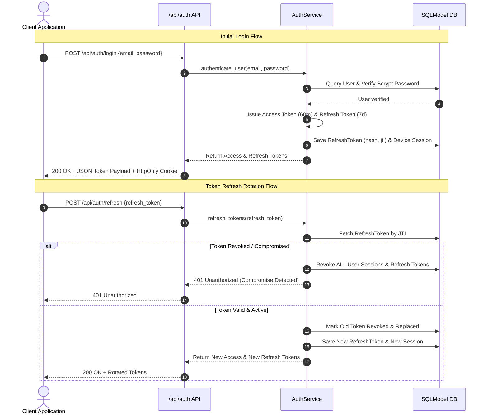

# JWT Authentication & Rotation Flow

```mermaid
sequenceDiagram
    autonumber
    actor User as Client Application
    participant Auth as /api/auth API
    participant Service as AuthService
    participant DB as SQLModel DB

    Note over User, DB: Initial Login Flow
    User->>Auth: POST /api/auth/login {email, password}
    Auth->>Service: authenticate_user(email, password)
    Service->>DB: Query User & Verify Bcrypt Password
    DB-->>Service: User verified
    Service->>Service: Issue Access Token (60m) & Refresh Token (7d)
    Service->>DB: Save RefreshToken (hash, jti) & Device Session
    Service-->>Auth: Return Access & Refresh Tokens
    Auth-->>User: 200 OK + JSON Token Payload + HttpOnly Cookie

    Note over User, DB: Token Refresh Rotation Flow
    User->>Auth: POST /api/auth/refresh {refresh_token}
    Auth->>Service: refresh_tokens(refresh_token)
    Service->>DB: Fetch RefreshToken by JTI
    alt Token Revoked / Compromised
        Service->>DB: Revoke ALL User Sessions & Refresh Tokens
        Service-->>Auth: 401 Unauthorized (Compromise Detected)
        Auth-->>User: 401 Unauthorized
    else Token Valid & Active
        Service->>DB: Mark Old Token Revoked & Replaced
        Service->>DB: Save New RefreshToken & New Session
        Service-->>Auth: Return New Access & New Refresh Tokens
        Auth-->>User: 200 OK + Rotated Tokens
    end
```
